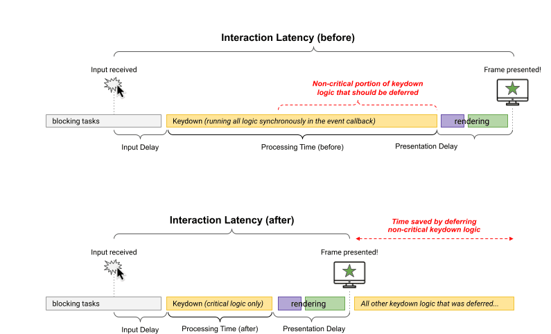
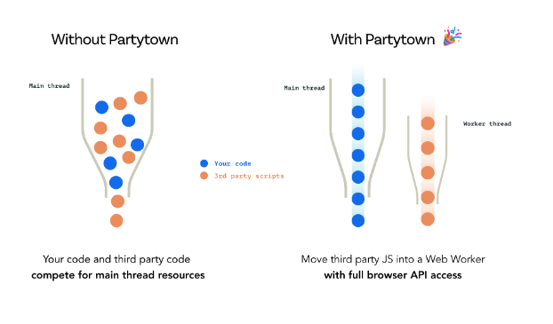

## INP and Partytown

Last few sprint implement logic to improve INP score and implement Partytown. 

Goals to imrpove CWV score especially INP and TBT score.

### INP

[INP](https://web.dev/articles/inp) is a metric that assesses a page's overall responsiveness to user interactions by observing the latency of all click, tap, and keyboard interactions that occur throughout the lifespan of a user's visit to a page. The final INP value is the longest interaction observed, **ignoring outliers**.

#### Improve INP

We use [setTimeout](https://web.dev/articles/optimize-inp#optimize_event_callbacks) to break up tasks, because the callback passed to it runs in a new task. We also combine it to [requestAnimatonFrame](https://developer.mozilla.org/en-US/docs/Web/API/window/requestAnimationFrame) if neccessary.

```JS
textBox.addEventListener('input', (inputEvent) => {
  // Update the UI immediately, so the changes the user made
  // are visible as soon as the next frame is presented.
  updateTextBox(inputEvent);

  // callBack inside requestAnimationFrame will be called when it's time to update your animation
  // Use `setTimeout` to defer all other work until at least the next
  // frame by queuing a task in a `requestAnimationFrame()` callback.
  // so with this the main thread will ready for the next execution. 
  // when there is no execution the callback will be called after
  requestAnimationFrame(() => {
    setTimeout(() => {
      const text = textBox.textContent;
      updateWordCount(text);
      checkSpelling(text);
      saveChanges(text);
    }, 0);
  });
});
```



### Partytown

[Partytown](https://partytown.builder.io/) is a lazy-loaded library to help relocate resource intensive scripts into a **web worker**, and off of the **main thread**. Its goal is to help speed up sites by dedicating the **main thread** to your code, and offloading third-party scripts to a **web worker**.

[Partytown](https://partytown.builder.io/)’s philosophy is that the main thread should be dedicated to your code, and any scripts that are not required to be in the critical path should be moved to a web worker.



## Main Thread
JavaScript's single-threaded nature means it can only execute one piece of code at a time. However, it means that if a particular piece of code takes too long to execute, it can block other tasks from running, leading to potential delays in your application's responsiveness. The approach we use for INP and Partytown are to reduce execution time in the main thread. so the main thread only runs critical logic.